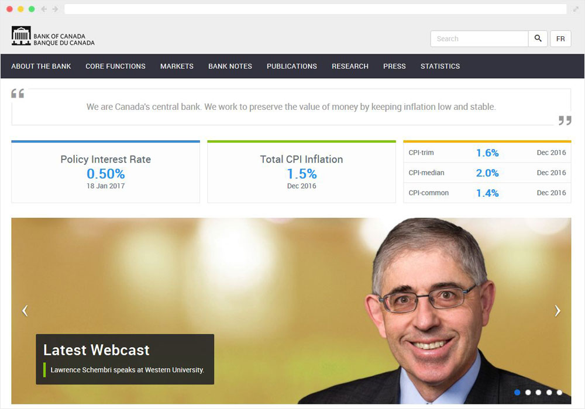

## Overview

As a co-op student, one of my tasks was to redesign / rework the existing homepage and try to modernize the look and feel of it, while maintaining the user experience.  In addition, I was also tasked with helping create new key market indicators that would look good on any device and be accessible to anyone (including screen readers). The key market indicators had to pull dynamically from our backend api as well.

To see the changes live, [click here](http://www.bankofcanada.ca/ "Bank of Canada").

## Result

Below you can find a number of screenshots from the updated page.

