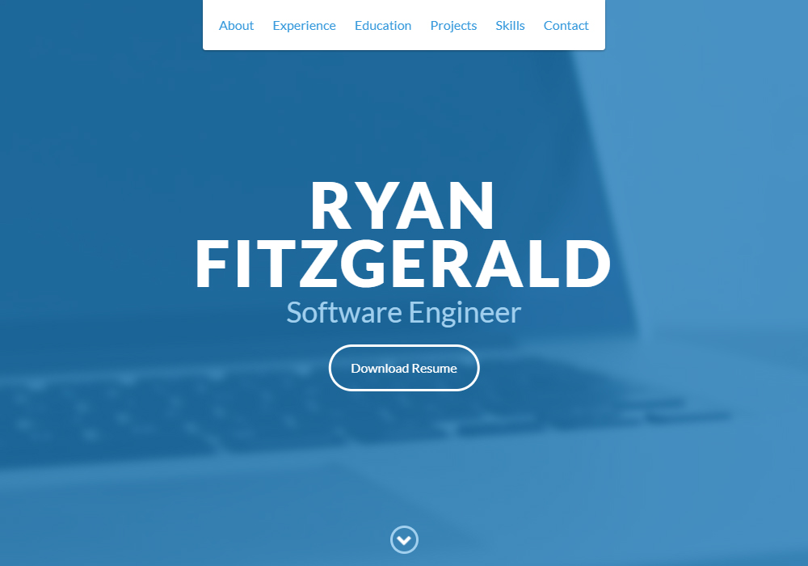
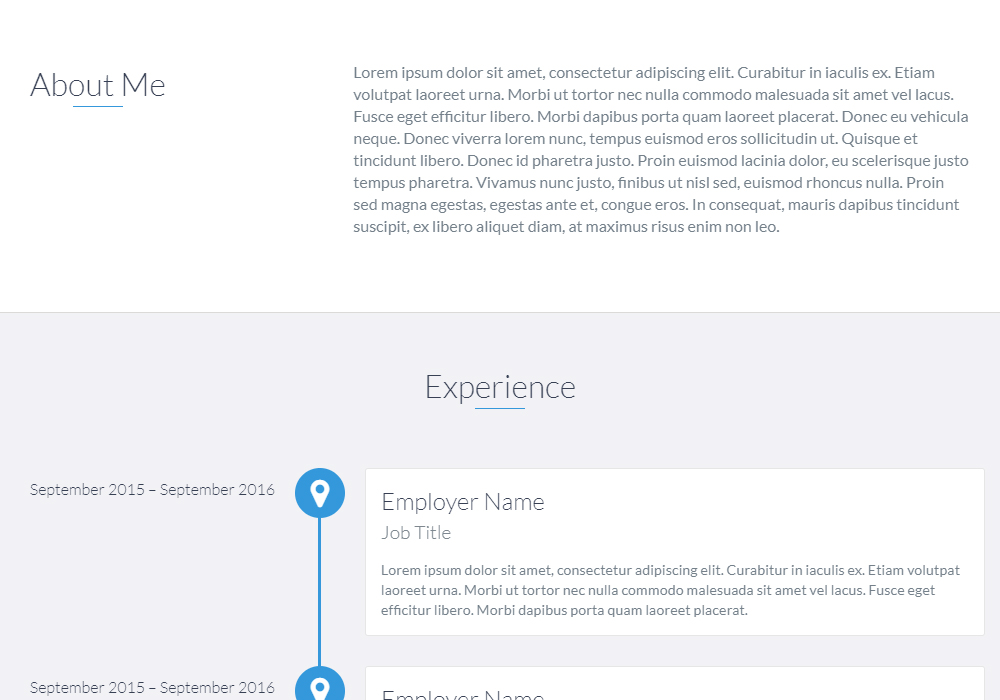
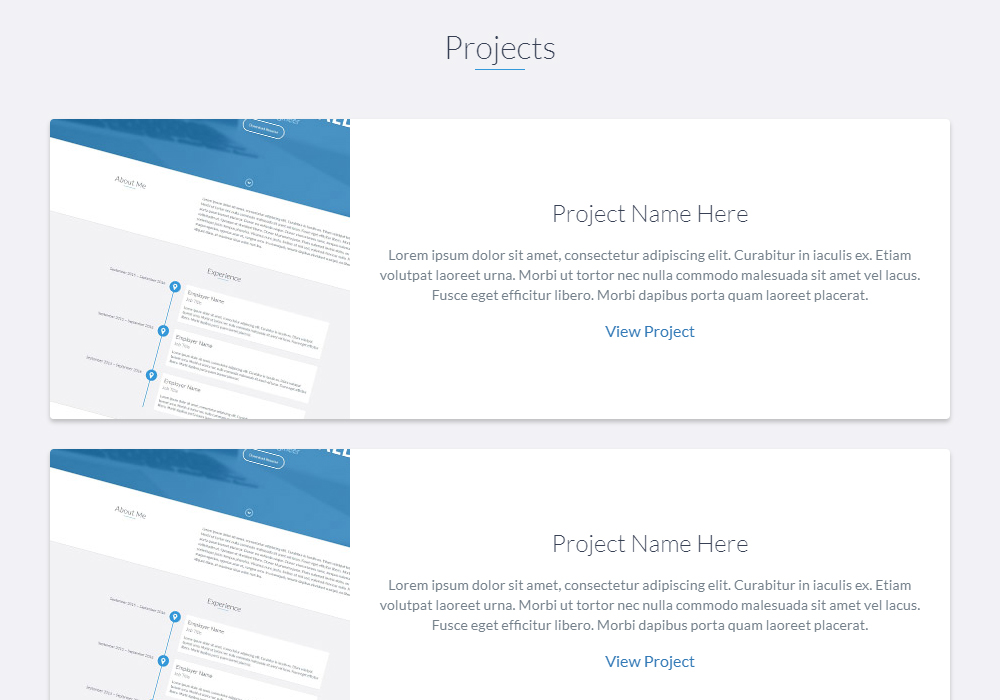

## Overview

DevPortfolio is an easy-to-customize personal dev portfolio template that was created with Sass and JavaScript. It is lightweight and fully responsive, as well as comes with the Bootstrap grid system and loaded with Font Awesome. The site is static and comes production ready if you just want to add your information and go. Alternatively, you can edit styles, colours, and scripts fairly easily. The site was built as modular as possible to make it easy to shift around styles and content.

The idea behind DevPortfolio came about after I noticed a number of developers wanted a personal website to showcase their work but either didn't the time to commit to one or they didn't have the frontend abilities to create something they liked. As a result, I threw together a template and got as much feedback as possible from developers. The template is built for quick edits or to use as is. The GitHub repo currently has over 1.8k stars.

To see the repo, [click here](https://github.com/RyanFitzgerald/devportfolio "GitHub Repo").

To see the template live, [click here](https://ryanfitzgerald.github.io/devportfolio "Live Preview").

## Result

Below you can find a number of screenshots from the template.

