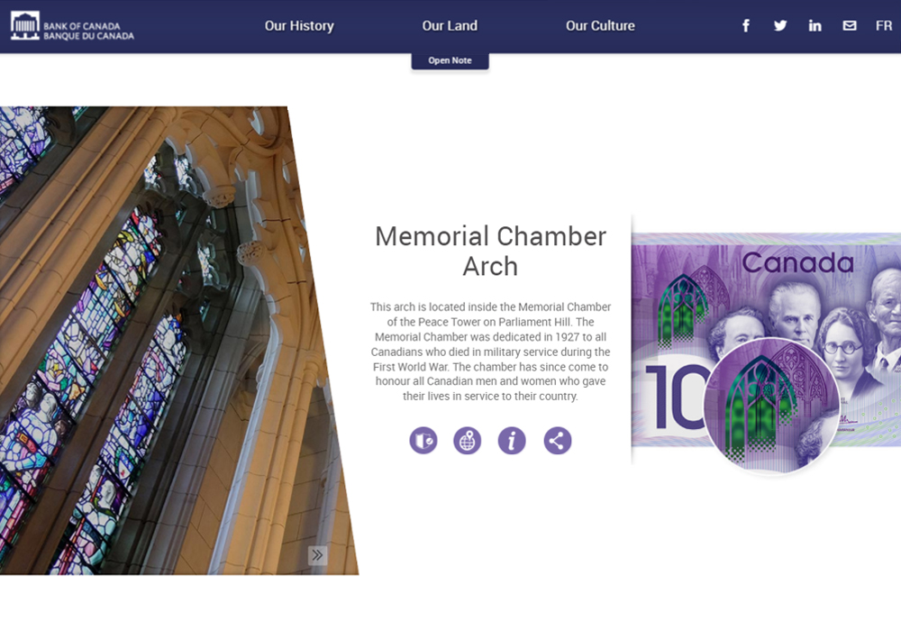
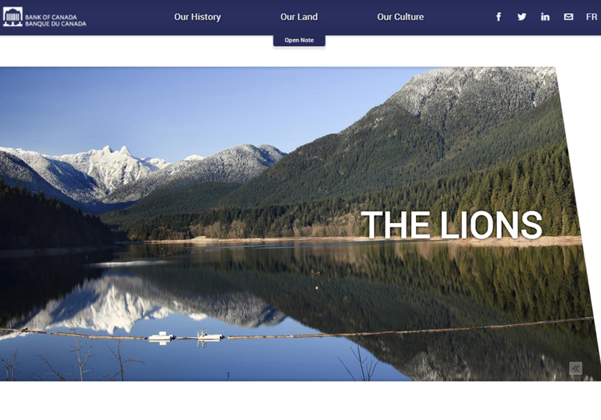

## Overview

To celebrate Canada’s 150th anniversary, a new $10 commemorative bank note representing the country was created. As one of the primary leads on the web page side of the project, I helped design and develop a product that showcases everything the note has to offer in a creative and user friendly way.

Throughout the entire project, we utilized an Agile project management approach where we clearly defined requirements in order to meet critical deadlines and stakeholder needs. After months of iterations, we finally came up with a final product that all parties involved were extremely happy with.

The web page itself was built using regular HTML, CSS, and JavaScript. With HTML and CSS, the general layout was designed and the decision was made to have it appear different from the rest of the site in order to further stick out from the regular site content. Moreover, JavaScript was used to improve the user experience and allow users to interact with the page in their own way. Finally, WebGL (three.js) was used to provide an interactive bank note.

Through continued collaboration, we were able to release a product that not only represents an evolution in Bank of Canada web design, but truly stands out in central banking as a whole. Moreover, we all were lucky enough to learn a lot throughout the process, from initial planning to final release.

To see the page live, [click here](http://www.bankofcanada.ca/banknotes/banknote150/ "C150").

## Result

Below you can find a number of screenshots from the web app.

