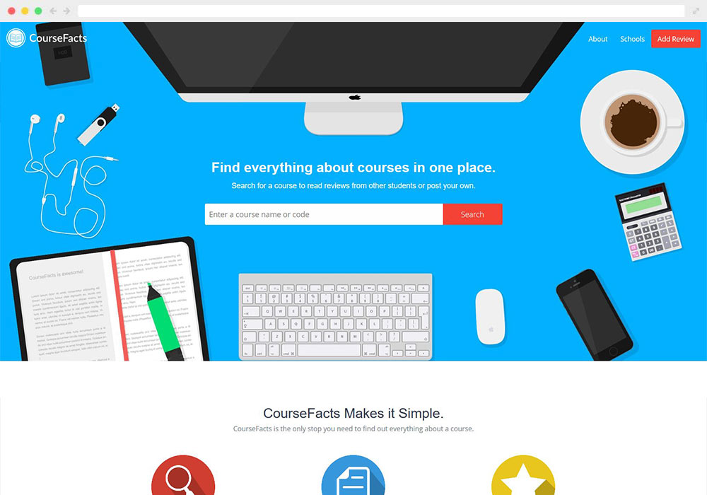
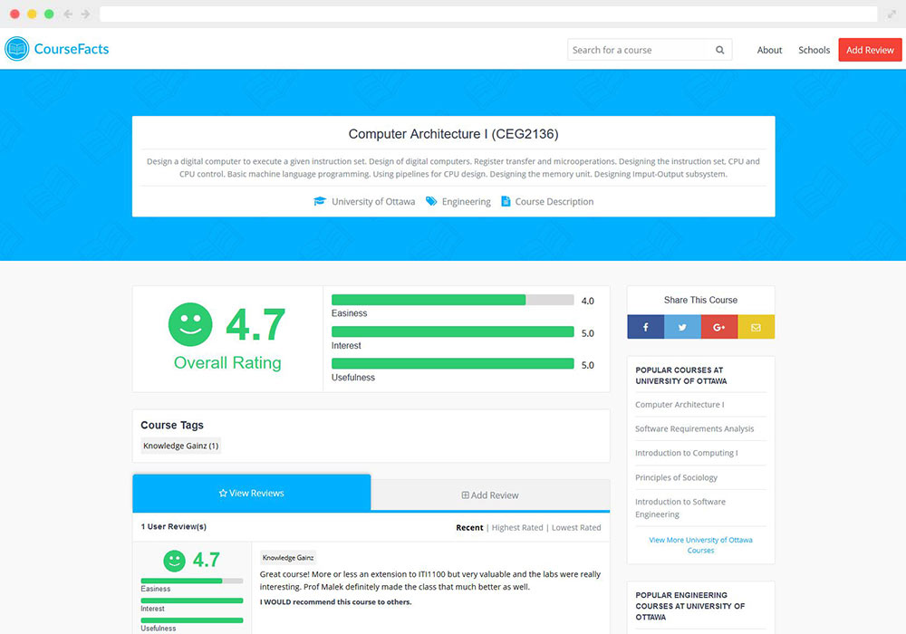
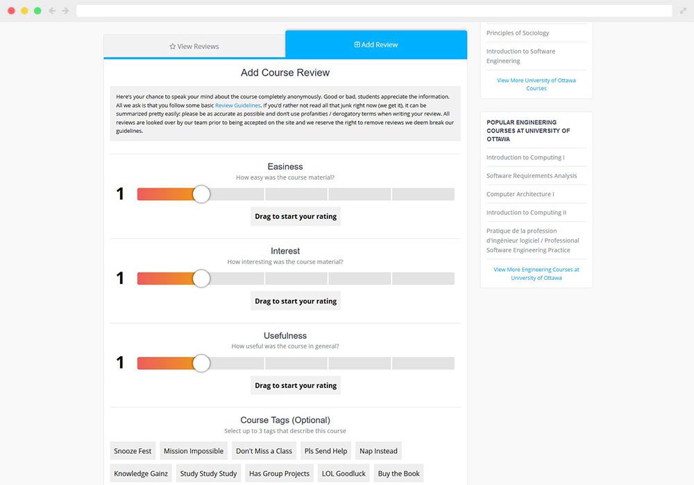

## Overview

CourseFacts is a side project I had worked on for quite some time. The primary goal of the site was to provide a solution to a problem: there are plenty of resources to learn about your professors, but very few, if any, to learn about potential courses.

In addition to solving the above problem, I also wanted to experiment with a new stack, which in this case was Ruby on Rails with PostgreSQL. In addition, I also used Foundation and JavaScript on the frontend. Moreover, this project was one of the first times I experimented with Docker and creating proper development flows (i.e. dev to staging to production). 

Needless to say, this side project was a great learning experience and it turned out to be fairly useful for other students as it received a couple hundred course reviews from students at the University of Ottawa.

To see the site live, [click here](https://coursefacts.com "CourseFacts").

## Result

Below you can find a number of screenshots from various pages within the web application.

